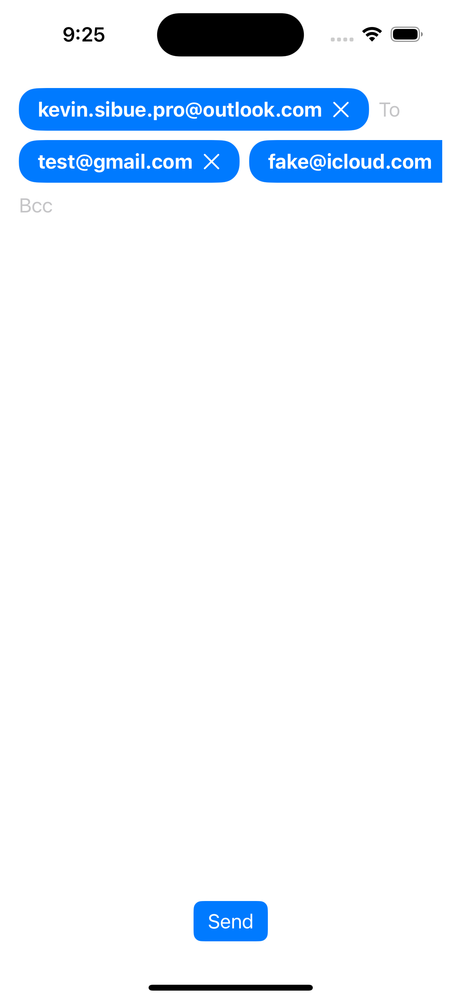
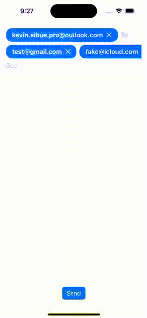

# EmailField

## Goal

Making your life easier!

Entering an email address is trivial, so is checking whether a string is a valid email address. But allowing multiple email addresses to be entered in the same field, while validating them, and making the whole thing user-friendly, is a little less so.

That's why I have created EmailField!

Now you can directly obtain the same behavior as your favorite mail manager without any effort!

## Screenshots and videos

|Fields and chips|Invalid and remove chips|
|---|---|
|||

## Dependencies

- SwiftUI (iOS >= 15, macOS >= 12)

## How install it?

Nowaday we only support Swift Package Manager. You can use build-in UI tool for XCode with this search words: `EmailField` or you can add it directly with this following command :

```bash
.package(url: "https://github.com/Kelvas09/EmailField.git", from: "1.0.0")
```

## How use it?

First of all you have to import the library `EmailField`:

```swift
import EmailField
```

Then you just have to add an `EmailField` on your screen:

```swift
...
EmailField(emails: $to, placeholder: "To")
EmailField(emails: $cc, placeholder: "Cc")
EmailField(emails: $bcc, placeholder: "Bcc")
...
```

Here is a complete example:

```swift
import SwiftUI
import EmailField

struct ContentView: View {
    @State
    private var to: [Email] = []

    @State
    private var cc: [Email] = []

    @State
    private var bcc: [Email] = []

    var body: some View {
        VStack {
            EmailField(emails: $to, placeholder: "To")
            EmailField(emails: $cc, placeholder: "Cc")
            EmailField(emails: $bcc, placeholder: "Bcc")
            Spacer()
            Button {
                //  Nothing to do here
            } label: {
                Text("Send")
            }
            .buttonStyle(.borderedProminent)
        }
        .padding()
    }
}
```

## Sample

You can access to sample project on folder `EmailFieldSample`